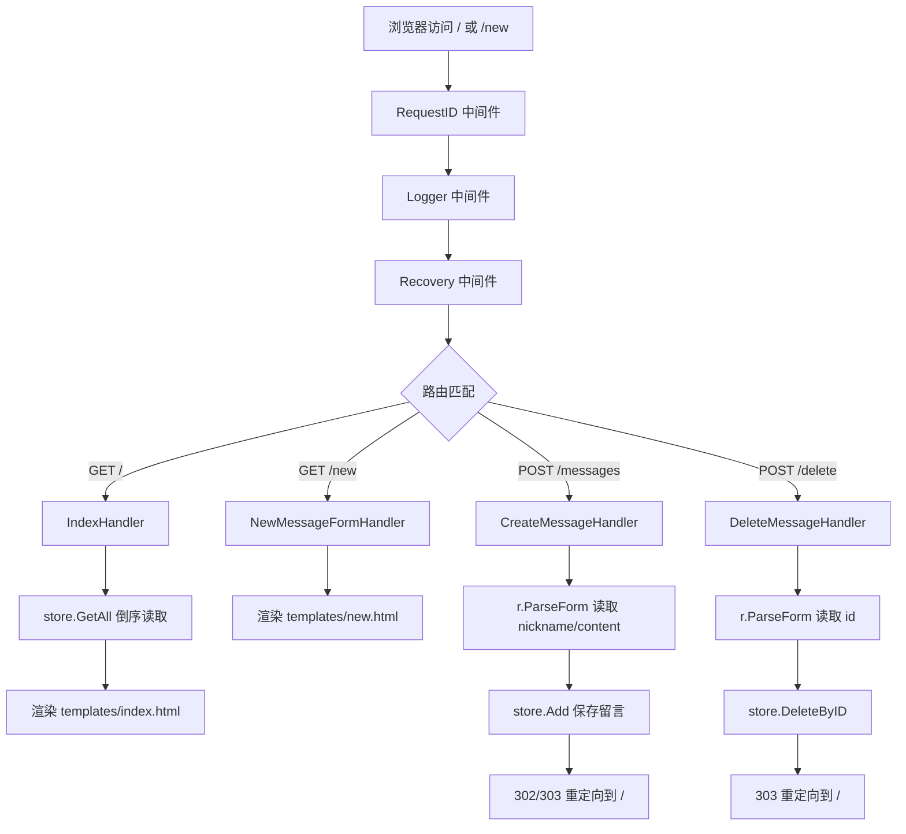

# 简易留言板（net/http）

这个项目是一个基于 Go 标准库 `net/http` 的入门留言板，支持：

- 查看留言列表
- 发布新留言
- 删除指定留言
- 中间件日志、崩溃恢复、请求 ID

## 1. 快速运行

在当前目录执行：

```bash
go run .
```

启动后访问：

- 首页：`http://localhost:8080/`
- 发布页：`http://localhost:8080/new`

## 2. 路由说明

- `GET /`：渲染首页，展示留言列表
- `GET /new`：渲染发布留言表单
- `POST /messages`：接收表单并创建留言
- `POST /delete`：根据留言 ID 删除留言
- `GET /static/*`：静态资源（CSS）

## 3. 程序流程图（Mermaid）



## 4. 表单数据传输与后端参数接收原理

核心点：昵称不是在 Go 代码里“手写发送”的，而是浏览器提交表单时自动带上的。

发布页 `templates/new.html` 里有：

```html
<form action="/messages" method="POST">
	<input type="text" name="nickname" required>
	<textarea name="content" required></textarea>
	<button type="submit">提交留言</button>
</form>
```

当你点击“提交留言”按钮时，浏览器会自动发一个 `POST /messages` 请求，请求体（`application/x-www-form-urlencoded`）大致是：

```txt
nickname=张三&content=你好
```

后端在 `CreateMessageHandler` 里：

```go
r.ParseForm()
nickname := r.FormValue("nickname")
content := r.FormValue("content")
```

就是从这个请求体里把昵称和内容取出来。

## 5. 手动模拟表单提交

你可以不用浏览器，直接 `curl`：

```bash
curl -X POST http://localhost:8080/messages \
	-d "nickname=Alice" \
	-d "content=Hello"
```

删除某条留言：

```bash
curl -X POST http://localhost:8080/delete -d "id=1"
```

## 6. 当前实现说明

- 存储是内存存储，服务重启后数据会丢失
- 删除是按留言 ID 删除，不会受列表倒序显示影响
- 中间件链已经生效：请求会经过 RequestID、Logger、Recovery
